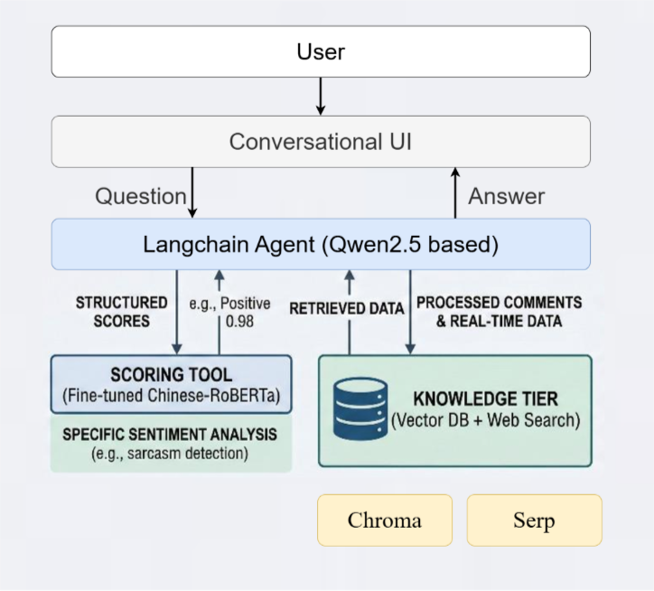

# PLP B站评论分析

暂定的方向是分析某个产品（可以是某个游戏/硬件/偶像团体）

以手机为例子：

- 挖掘用户对各某手机品牌（苹果 / 华为 / 小米 / 荣耀 / OPPO/vivo）的**真实口碑与情感倾向**
- 找出**高频痛点、购买决策因素、种草关键词**
- 评估 B 站 UP 主**测评内容的种草效果**
- 给出**品牌营销建议**

对于某一个关键词（比如品牌），可能的输出格式：

## ①基础统计（可格式化，可用基础文本分析工具）

比如：

- 评论量、热评占比
- 情感分布：正面 / 中性 / 负面

## ②总结购买意图（高价值，LLM/agent总结）

比如：

- 想买 / 已入手 / 准备冲 / 蹲降价 / 求链接
- 纠结 X 和 Y / 选 X 还是 Y
- 学生党 / 工作党 / 游戏党

## ③咨询交互UI

可供用户询问自己关心的问题/不懂的术语等，比如：

①[【minka】论萌佛熟了之后有多甜..._哔哩哔哩_bilibili](https://www.bilibili.com/video/BV1Y4e6ejEGk/?spm_id_from=333.337.search-card.all.click&vd_source=913c34b22211083f75ee1abf6ed45aef)

Q: 评论区的2399是什么意思

② [【Red Velvet】IRENE, SEULGI, KARINA, WINTER《Chu~♡》(f(x)) Cover Stage_哔哩哔哩_bilibili](https://www.bilibili.com/video/BV1bKFhzSEpW/?spm_id_from=333.1391.0.0&vd_source=913c34b22211083f75ee1abf6ed45aef)

Q: 这个cover里谁最受欢迎

③ [《宗门大会》蔡徐坤直播时看自己鬼畜视频自己都绷不住【整活】_哔哩哔哩_bilibili](https://www.bilibili.com/video/BV1QuFUz6EvC/?vd_source=913c34b22211083f75ee1abf6ed45aef)

Q: 谁是鸡哥

- **站内层**：爬 B 站评论→向量化存储→Agent 检索站内评论
- **全网层**：SerpAPI（谷歌搜索）/ 百度 API→补充全网信息（价格、竞品、舆情、官方回应等）
- **Agent 决策层**：LangChain Agent (`Qwen2.5-7B-Instruct`)自动判断
    - 若问题能通过 B 站评论回答→直接用向量库检索回答；
    - 若需要全网信息（如 “这款手机全网最低价多少”）→调用 SerpAPI 补充后回答；
    - 若需要结合两者（如 “B 站用户吐槽的小米 14 发热问题，全网有没有官方回应”）→融合双源信息回答。

以下是网络的架构图
