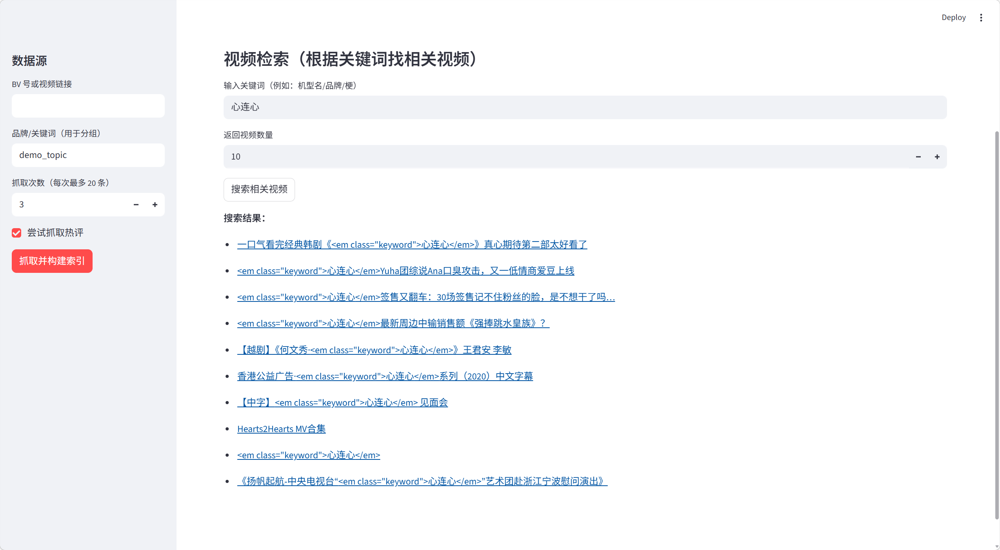
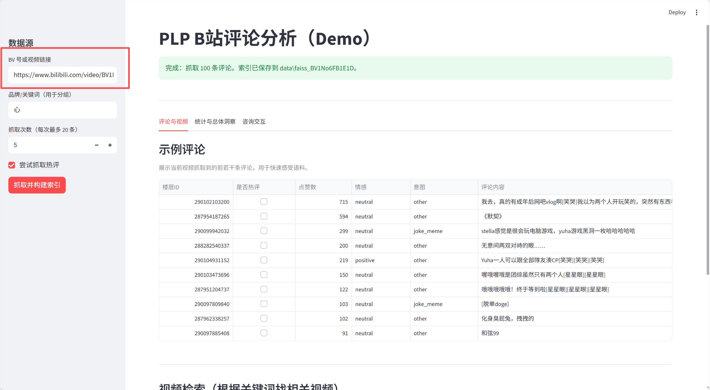
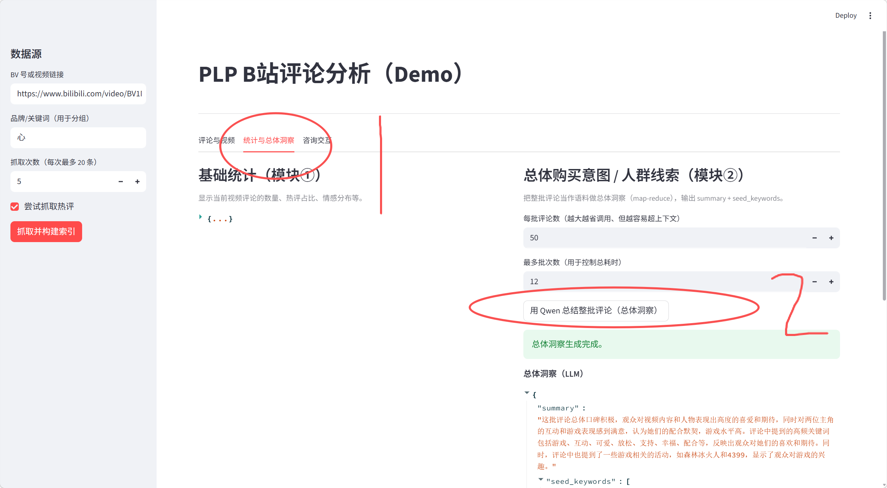

## 快速运行（Windows / PowerShell）

### 1) 安装依赖

```bash
python -m venv .venv
.\.venv\Scripts\Activate.ps1
pip install -r requirements.txt
pip install -e .
```

### 2) 配置.env
- `QWEN_MODEL`（默认 `qwen2.5-7b-instruct`）
- `BILI_COOKIE` 从浏览器拿

### 3) 启动 UI

```bash
streamlit run .\app_ui\streamlit_app.py
```

### 4) 使用方式

1. 检索相关视频

`以心连心为例子`


2. 随便粘贴一个视频检索评论


3.



4. 交互